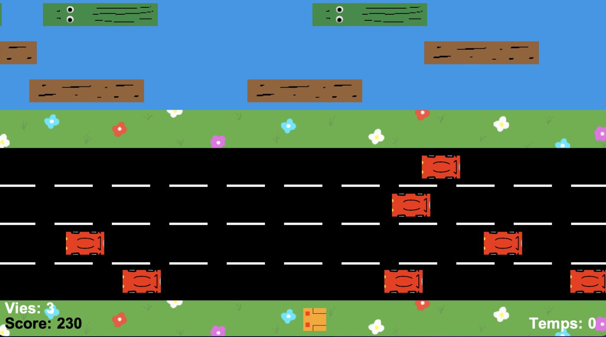

# FROGGER

Recréer le jeu Frogger en Java en y ajoutant des fonctionnalités avancées, en
particulier des modes multijoueurs en réseau, des obstacles dynamiques, un
classement des joueurs en fonction de leur score et un serveur multi-clients
adaptatif.

## Fonctionnalités à implémenter
### 1. Mode Solo
Le joueur dirige une grenouille qui doit traverser une route puis une rivière
sans se faire écraser ou tomber dans l'eau.
Obstacles classiques : voitures (route), rondins (rivière), crocodiles (rivière),
tondeuses/serpents (terre-plein central).
Objectif : atteindre un nombre de points d’arrivée (accueil des grenouilles).
### 2. Modes Réseau
  A. Mode Collaboratif
###
Variante 1 : Objectif d’équipe — sauver un maximum de grenouilles en coopération (nombre total).
###
Variante 2 : Un ou plusieurs joueurs incarnent une grenouille carnivore et doivent manger les autres joueurs.
###
  B. Mode Compétition
###
Variante 1 : Le premier joueur à sauver n grenouilles gagne.
###
Variante 2 : Le joueur ayant sauvé le plus de grenouilles au bout de m minutes gagne.
### 3. Obstacles dynamiques
Présence de crocodiles dans la rivière (qui apparaissent et disparaissent sur
un intervalle de temps donné).
### 4. Classement utilisateur
Score du joueur (Si son score est dans le classement des 10 meilleurs scores
réalisés par les joueurs alors le tableau des scores est modifié et le nouveau
record est inscrit)
Stockage dans un fichier .txt associé à une classe Java pour l’écriture
### 5. Serveur Multi-clients et adaptatif

Plusieurs clients peuvent se connecter.
Le serveur gère plusieurs types de parties.
Si un client lance une partie réseau et ne trouve pas d’autres clients (minimum 1) en 60 secondes, alors elle bascule automatiquement en mode solo.
Le serveur adapte la difficulté du jeu (vitesse des obstacles) en fonction du
niveau du joueur.
